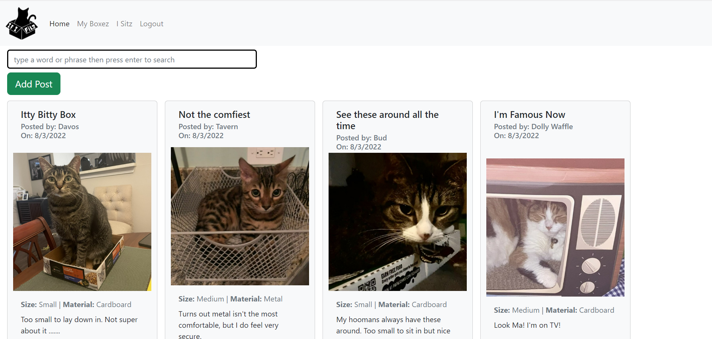
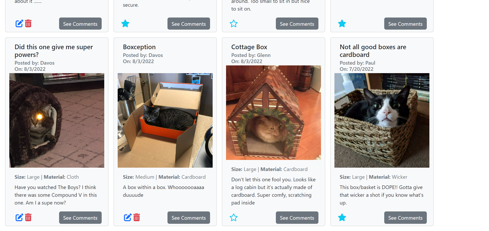
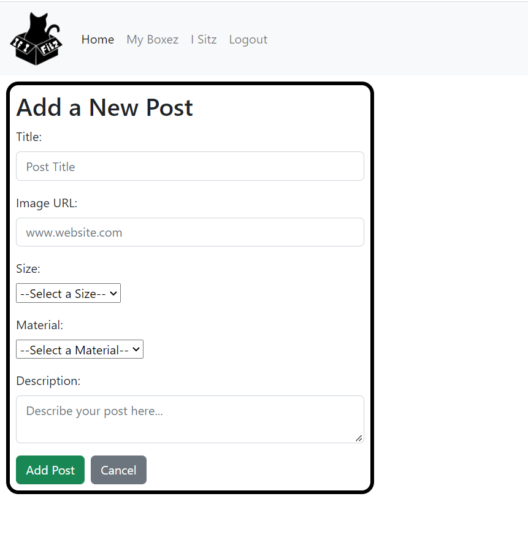
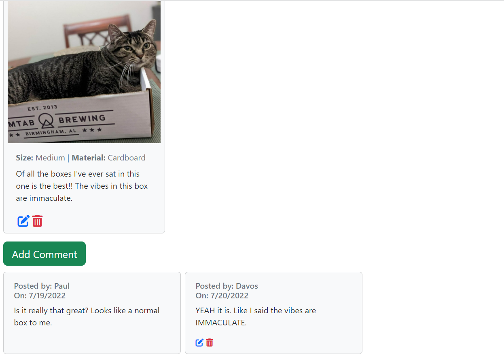

# If I Sitz

If I Sitz is a collection web app for cats to share all of the various boxes they like to sit and nap in. In addition to posting boxes cats can view and favorite other cat's boxes. They can edit and delete their own, and comment on their own and others. The client-side was built in JavaScript with the React framework, and styled with CSS and Reactstrap. The server-side was built in C#/.NET.

## Technologies
- HTML/CSS
- Javascript
- React
- Reactstrap
- C#/.NET
- ERD with dbdiagram
- Canva
- Swagger
- Git/GitHub

[ERD on dbdiagram.io](https://dbdiagram.io/d/62cf3a4ecc1bc14cc5b3040a)

## Screenshots

